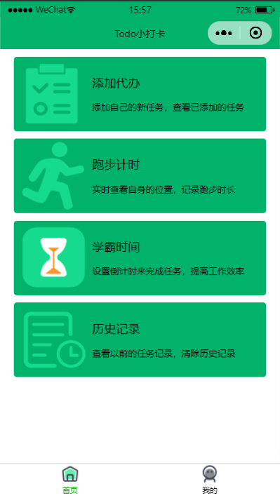
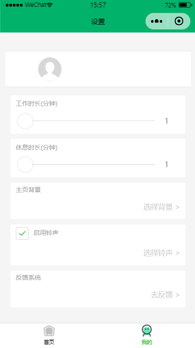

# 小程序打卡

#### 介绍

提供用户便捷打卡，添加代办，跑步计时打卡等功能

#### 效果展示

##### 首页

- 模块分析：（目前想到的功能）
    - 运动计时（运动页面）
    - 专注计时（工作和休息那个页面）
    - 添加代办（代办页面）
    - 专注计时的历史记录

首页大概目前就是上面这些功能，四个模块，点击后跳转到相应的页面

模块说明：
- 运动计时
    - 基本需求：
        - 计时（开始 和 暂停 和 结束），包括记录 时长 和 路程 和 运动模式
        - GPS定位
    - 大概逻辑：
        - 计时用现成的
        - GPS定位，先诱导用户打开授权页面，授权定位，返回运动页面
        - 当用户点击结束运动时，记录 时长，路程，运动模式，方便后续统计数据
- 专注计时
    - 基本需求：
        - 工作计时按钮，提供开始，暂停，结束
        - 休息计时按钮，提供开始，暂停，结束
    - 业务逻辑：
        - 用现成的，当用户点击结束后，记录 工作时长 和 休息时长，方便后续统计数据
- 添加代办
    - 基本需求：
        - 全部代办页面，显示每条代办的前面一部分文字，每条代办可勾选 完成 和 未完成 状态，可添加代办
    - 业务逻辑：
        - 用现成的，添加代办改一下，用一个‘+’图标，然后底部弹出输入框，每次添加的时候，记录 总数加一
        - 添加跳转详情页面，根据ID跳转到详情页面后，渲染对应的信息，可修改其他信息
        - 记录添加的代办条数，未完成条数，已完成条数（包括曾经完成的，用 总数 减去 未完成数 的就行），方便后续统计数据
- 数据统计
    - 基本需求：
        - 总体查看上面三个模块的基本数据
    - 业务逻辑：
        - 做成三个图表，分别表示上面三个模块，用之前记录的信息来制作图表
------------------------------------------------------------------------------------------------------------------------------
##### 我的 
- 模块分析：（待确认，看一下小程序有没有现成的API，做一些容易做的小功能丰富页面）
    - 登录用户名模块
    - 自定义主题背景设置模块
    - 帮助|常见问题
    - 联系客服

#### 安装教程

1.  xxxx
2.  xxxx
3.  xxxx

#### 使用说明

1.  xxxx
2.  xxxx
3.  xxxx

#### 参与贡献

1.  Fork 本仓库
2.  新建 Feat_xxx 分支
3.  提交代码
4.  新建 Pull Request

